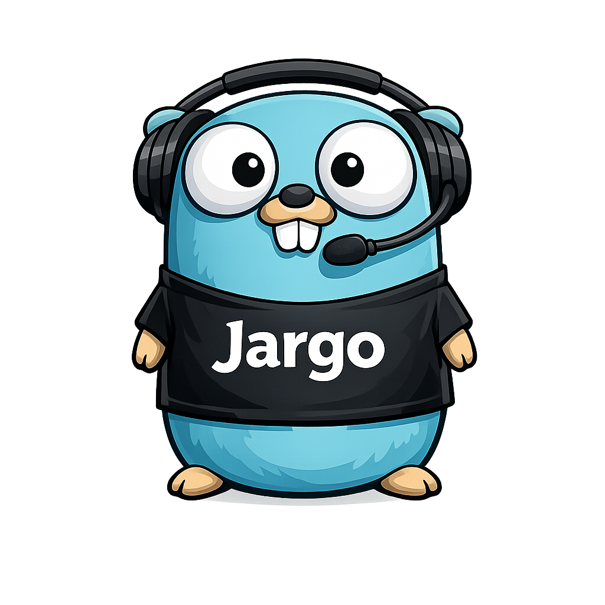

<div align="center">



**A WebRTC-native, audio-first conversational-AI framework for Go.**

[](https://github.com/gojargo/jargo/actions/workflows/ci.yml)
[](https://pkg.go.dev/github.com/gojargo/jargo)
[](https://goreportcard.com/report/github.com/gojargo/jargo)

[](https://github.com/gojargo/jargo/releases)
[](LICENSE)

</div>

---

jargo builds real-time voice agents: audio comes in over WebRTC, flows through a
pipeline of processors (transcription → reasoning → speech), and audio goes back
out — with [RTVI](https://docs.pipecat.ai/client/introduction) on the data
channel so existing RTVI clients interoperate.

> **Status:** early work in progress. APIs are unstable and will change.

## Install

```sh
go get github.com/gojargo/jargo
```

## Examples

```sh
# Echo bot — speak into the browser, hear yourself back over WebRTC.
go run ./examples/echo                 # then open http://localhost:8080

# Voice bot — Deepgram (STT) → Anthropic (LLM) → ElevenLabs (TTS).
export DEEPGRAM_API_KEY=...
export ANTHROPIC_API_KEY=...
export ELEVENLABS_API_KEY=...
go run ./examples/voicebot             # then open http://localhost:8080
```

## License & attribution

jargo is a Go port of [Pipecat](https://github.com/pipecat-ai/pipecat),
distributed under the same **BSD 2-Clause License**. The upstream copyright —
*Copyright (c) 2024–2026, Daily* — is preserved verbatim in [`LICENSE`](LICENSE);
see [`NOTICE`](NOTICE) for details. jargo is an independent project, not
affiliated with or endorsed by Daily.
