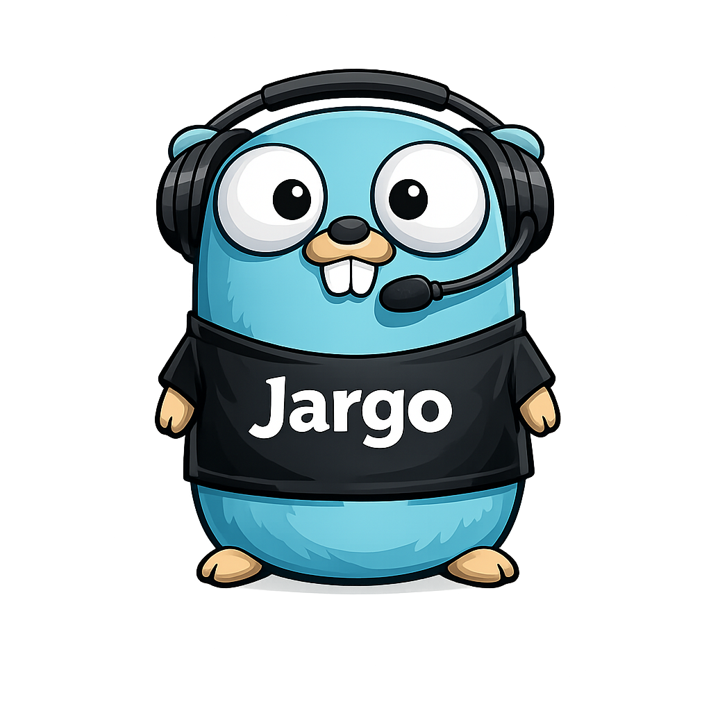

<div align="center">



**A WebRTC-native, audio-first conversational-AI framework for Go.**

[](https://github.com/gojargo/jargo/actions/workflows/ci.yml)
[](https://codecov.io/gh/gojargo/jargo)
[](https://pkg.go.dev/github.com/gojargo/jargo)
[](https://securityscorecards.dev/viewer/?uri=github.com/gojargo/jargo)

[](https://github.com/gojargo/jargo/releases)
[](LICENSE)

</div>

---

**jargo** is a framework for real-time voice agents in Go: audio in over WebRTC,
a streaming transcription → reasoning → speech pipeline with turn-taking and
barge-in, and audio back out.

## Why?

[Pipecat](https://github.com/pipecat-ai/pipecat) is great, and jargo is a port of
it. The architecture and many design decisions are Pipecat's.

### Python might not be the way

This port exists for one reason: I'd rather not run a voice agent on Python.

Python is the right tool when you need the AI/data-science ecosystem. A
real-time voice *server* doesn't: the models run as services or as ONNX, and
what's left is plumbing: audio framing, WebRTC, concurrency, and shipping a
binary. For that, Go is a better fit: one static binary to deploy, low and
predictable memory, fast startup, and real concurrency for many simultaneous
sessions without a GIL. The heavy numerics stay where they belong (the ONNX
Runtime, the remote services), so giving up Python costs little here. See the
[benchmarks](https://github.com/gojargo/jargo-benchmarks) for the honest performance picture.

## Features

- **Transports**: WebRTC ([Pion](https://github.com/pion)), WebSockets, LiveKit and local audio.
- **Audio**, pure Go: Opus encode and decode via [pion/opus](https://github.com/pion/opus), resampling via [go-resample](https://github.com/gojargo/go-resample). No cgo, and no build tag that adds any.
- **Streaming voice pipeline**: STT → LLM → TTS, with prompt caching.
- **Speech-to-speech**: single-model voice agents (OpenAI Realtime, Gemini Live, AWS Nova Sonic).
- **Turn-taking & barge-in**: [Silero VAD](https://huggingface.co/onnx-community/silero-vad) + [Smart Turn v3](https://huggingface.co/pipecat-ai/smart-turn-v3), local ONNX. Both models are embedded in the binary.
- **Telephony** (optional): inbound/outbound phone calls over Twilio Media Streams.
- **User-idle watchdog**: re-engage or hang up when the caller goes silent.
- **RTVI** data channel: works with existing RTVI clients.
- **Pluggable services**: swap any STT/LLM/TTS behind a small interface.
- **Concurrent by design**: independent processors; interruptions are frames.

## Providers

Pick any per category; each is a small `Config` + constructor.

- **STT**: Deepgram, AssemblyAI, Gladia, Speechmatics, Soniox, Whisper (OpenAI/Groq/local), Azure, xAI, ElevenLabs, Cartesia, NVIDIA.
- **LLM**: Anthropic (direct + Bedrock), OpenAI (chat + Responses), Google Gemini (direct + Vertex), Groq, Together, Fireworks, DeepSeek,
  Cerebras, Perplexity, OpenRouter, xAI, Ollama, NVIDIA, Mistral, Nebius, SambaNova, Qwen, Azure OpenAI.
- **TTS**: ElevenLabs, Cartesia, Rime, LMNT, Kokoro, Piper, Pocket TTS, Deepgram, OpenAI, Azure, Hume, Fish, MiniMax, xAI, NVIDIA, Soniox.
- **Speech-to-speech**: OpenAI Realtime (direct + Azure), Gemini Live (direct + Vertex), AWS Nova Sonic, xAI Realtime.
- **Memory**: mem0.

## Usage

```sh
go get github.com/gojargo/jargo
```

A bot is an STT → LLM → TTS pipeline over a WebRTC transport. The heart of it:

```go
stt := chat.NewSTT(chat.STTConfig{APIKey: key, SampleRate: opus.SampleRate})
llm := chat.NewLLM(chat.LLMConfig{APIKey: key})
tts := chat.NewTTS(chat.TTSConfig{APIKey: key})

t := rtc.NewTransport(conn, transport.DefaultParams())
agg := aggregators.New(frames.NewLLMContext("You are a helpful voice assistant."))

task := pipeline.NewWorker(pipeline.New(
	t.Input(), stt, agg.User(), llm, tts, t.Output(), agg.Assistant(),
), pipeline.WorkerConfig{})
task.Run(ctx)
```

[`examples/voice/openai`](examples/voice/openai) is that pipeline as a complete
server (WebRTC signaling, VAD/turn-taking, barge-in).

**Run it in Docker**: build on the `gojargo/jargo-build` base and ship on the
distroless `gojargo/jargo` runtime (it bundles the ONNX Runtime), then:

```sh
docker run --rm -p 8080:8080 -e OPENAI_API_KEY=$OPENAI_API_KEY my-bot
```

See **[Deploy with Docker](docs/deploy/docker.md)** for the Dockerfile and
the **[Quickstart](docs/getting-started/quickstart.md)** for the full setup.

## Examples

Runnable bots live in [`examples/`](examples):

- **echo**: hear yourself back, no API keys.
- **voicebot**: the full voice agent (STT → LLM → TTS over WebRTC) with
  turn-taking, long-term memory, and tracing.
- **voice/**: one headless backend per provider, each wiring its STT/LLM/TTS
  explicitly and exposing the WebRTC `/offer` endpoint (no web UI). Run with
  `go run ./examples/voice/<provider>` (e.g. `deepgram`, `cartesia`, `openai`)
  and drive it from a browser client, the `nextjs-voicebot` in
  [jargo-client-react](https://github.com/gojargo/jargo-client-react).
- **twiliobot**: a phone agent over Twilio Media Streams, with the idle watchdog.

The fastest way to try them (locally or with Docker) is the
**[Quickstart](docs/getting-started/quickstart.md)**.

```sh
go run ./examples/echo                 # then open http://localhost:8080
```

## Documentation

**[gojargo.github.io/jargo](https://gojargo.github.io/jargo/)** is the full
documentation. The same pages live in [`docs/`](docs) and read fine on GitHub.

Start with [Architecture](docs/concepts/architecture.md) for the model, or
[Frames](docs/concepts/frames.md) and [Processors](docs/concepts/processors.md) for
the engine. [Writing a processor](docs/extending/custom-processor.md) covers
extending it. The API reference is the
[Go reference](https://pkg.go.dev/github.com/gojargo/jargo).

## What you need to install

Nothing, to build: the default build is **cgo-free**, so `CGO_ENABLED=0 go build
./...` works with no C toolchain and no system packages.

To run a voice bot you need one shared library, and only for turn-taking:

| What | When you need it | How to get it |
| --- | --- | --- |
| **ONNX Runtime** | VAD and end-of-turn detection. Without it the bot still runs, on STT endpointing, and loses barge-in. | `make deps-onnx`, or a [release](https://github.com/microsoft/onnxruntime/releases) |
| **RNNoise** | Optional input noise reduction. | `make deps-rnnoise` |

Both libraries are loaded at run time through
[purego](https://github.com/ebitengine/purego), so they are never needed at build
time. Point jargo at them with `JARGO_ONNXRUNTIME_LIB` and `JARGO_RNNOISE_LIB`, or
leave them on the loader's default search path. The
[base images](docs/deploy/docker.md) bundle all of them.

## License & attribution

jargo is a Go port of [Pipecat](https://github.com/pipecat-ai/pipecat),
distributed under the same **BSD 2-Clause License**. The upstream copyright
(*Copyright (c) 2024–2026, Daily*) is preserved verbatim in [`LICENSE`](LICENSE);
see [`NOTICE`](NOTICE) for details. jargo is an independent project, not
affiliated with or endorsed by Daily.
