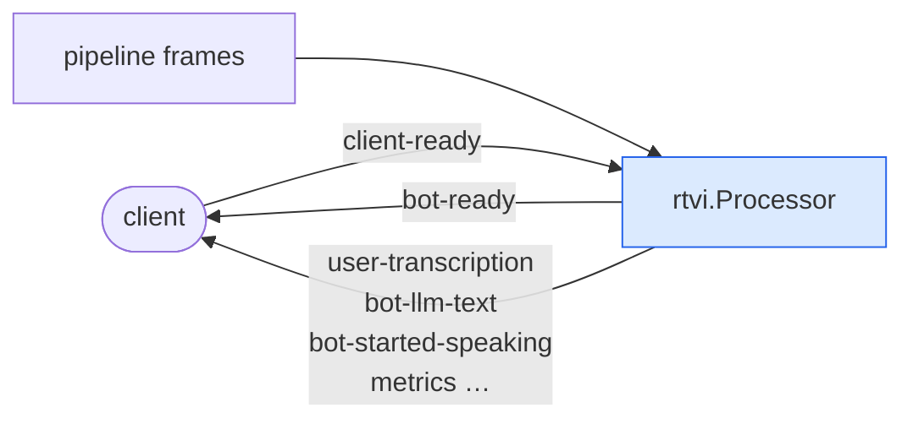

# RTVI

Audio is only half of what a client needs. A usable UI also wants transcriptions
as they arrive, who is speaking right now, and when the bot is thinking. RTVI
(Real-Time Voice Interface) is the JSON protocol that carries those events over the
WebRTC data channel.

Because it is an open protocol with existing web, iOS and Android client SDKs, a
jargo server works with clients you did not write.

## Adding it

One processor, placed **at the top of the pipeline**, ahead of the input
transport. What the client sends travels down the pipeline from there, by the
same path a real caller's input takes, and the messages it sends back reach the
output transport at the far end:

```go
pipeline.New(
    rtvi.NewProcessor(),   // <- here
    t.Input(), vadProc, stt, turnsProc,
    agg.User(), llm, tts,
    t.Output(), agg.Assistant(),
)
```

That is the whole integration. The processor watches frames going past and
translates the interesting ones into client messages.

## What it does



Incoming client messages arrive as `InputTransportMessageFrame`s; outgoing ones
are pushed downstream as `OutputTransportMessageUrgentFrame`s. **Urgent**, so a
transcription reaches the UI ahead of queued audio instead of lagging behind the
speech it describes.

## The messages

Every message is `{"label":"rtvi-ai","type":…,"id":…,"data":…}`. The processor
speaks protocol version `2.0.0`.

| Type | Meaning |
|---|---|
| `client-ready` → `bot-ready` | The handshake. |
| `user-transcription` | What the user said (interim and final). |
| `bot-transcription` | What the bot said. |
| `bot-llm-text` / `bot-tts-text` | Streamed response text, per stage. |
| `user-started-speaking` / `user-stopped-speaking` | Turn boundaries. |
| `vad-user-started-speaking` / `vad-user-stopped-speaking` | The raw VAD signal, off by default. |
| `bot-started-speaking` / `bot-stopped-speaking` | Bot speech boundaries. |
| `bot-interrupted` | The bot was cut off; drop what it was mid-saying. |
| `bot-llm-started` / `bot-llm-stopped` | Model is generating. |
| `bot-tts-started` / `bot-tts-stopped` | Speech is being synthesized. |
| `llm-function-call-started` / `-in-progress` / `-stopped` | Tool activity, stage by stage. |
| `user-audio-level` / `bot-audio-level` | How loud each side is, for a speaking meter. Off by default. |
| `dtmf` | Client presses keypad keys. |
| `metrics` | TTFB, processing time, token usage. |
| `send-text` | Client sends text instead of speech. |
| `raw-audio` / `raw-audio-batch` | Client sends audio it captured itself. |
| `disconnect-bot` | Client hangs up; the pipeline ends gracefully. |
| `llm-function-call-result` | Result of a tool the client ran for the bot. |
| `client-message` → `server-response` | Anything else the client asks, and the answer. |
| `server-message` | Anything else the bot tells the client, unprompted. |
| `error-response` | A request could not be carried out. |
| `error` | Something failed. |

The constants live in `processor/rtvi` (`rtvi.TypeUserTranscription` and so on),
so you do not hand-write the strings.

### Messages of your own

`client-message` carries whatever the protocol has no message for. It arrives as
a `rtvi.ClientMessageFrame` travelling downstream, so a processor anywhere in the
pipeline can answer it by pushing a `rtvi.ServerResponseFrame` naming the request:

```go
if msg, ok := f.(*rtvi.ClientMessageFrame); ok && msg.Type == "set-theme" {
    return p.PushFrame(ctx, rtvi.NewServerResponseFrame(msg, map[string]any{"ok": true}), processor.Upstream)
}
```

`rtvi.NewServerErrorResponseFrame(msg, reason)` refuses it instead, and the client
gets an `error-response`. Either way the request is answered, so a client waiting
on a reply is never left waiting.

Outside the pipeline, attach to the processor's `rtvi.EventClientMessage` and
answer with `SendServerResponse` or `SendErrorResponse`. To tell the client
something nothing asked for, push a `rtvi.ServerMessageFrame` or call
`SendServerMessage`.

### How much a tool call reports

A tool call's name and its arguments can carry information a client has no
business seeing, so the observer reports the tool call id alone by default. Raise
it per function, with `"*"` setting the default for the rest:

```go
params := rtvi.ObserverParams{
    FunctionCallReportLevel: map[string]rtvi.FunctionCallReportLevel{
        "*":           rtvi.ReportNone, // id only
        "get_weather": rtvi.ReportFull, // name, arguments and result
    },
}
observer := rtvi.NewObserverWithParams(proc, params)
```

The levels are `disabled` (no event at all), `none`, `name` and `full`. The raw
VAD speaking events are off by default in the same way, under
`VADUserSpeakingEnabled`.

So are the audio levels a client draws a speaking meter from, under
`UserAudioLevelEnabled` and `BotAudioLevelEnabled`. They are a message every
`AudioLevelPeriod` (150 ms by default) for as long as the call lasts, which a
client that draws no meter does not want. The level is loudness on a 0..1 scale,
measured over a rolling 400 ms window rather than per frame, so it reads 0 until
enough audio has arrived to measure.

## Clients

For the browser, use the client packages in
[jargo-client-react](https://github.com/gojargo/jargo-client-react). The
`nextjs-voicebot` example there talks to any of the `examples/voice/<provider>`
backends:

```sh
go run ./examples/voice/openai                        # backend on :8080
NEXT_PUBLIC_JARGO_URL=http://localhost:8080 npm run dev   # client
```

The per-provider examples are **headless**: they expose the `/offer` endpoint and
no UI, so a client is required. `examples/echo` and `examples/voicebot` serve
their own minimal page and need nothing extra.

## Without RTVI

The processor is optional. Leave it out and you still have working audio. You
just have no event stream, so the UI cannot show live transcriptions or speaking
state. Phone transports have no data channel at all, which is why
[`examples/twiliobot`](../../examples/twiliobot) omits it.

To send your own application messages instead, push an
`OutputTransportMessageFrame` (ordered with the audio) or an
`OutputTransportMessageUrgentFrame` (ahead of it), and read
`InputTransportMessageFrame` for what the client sends back.
